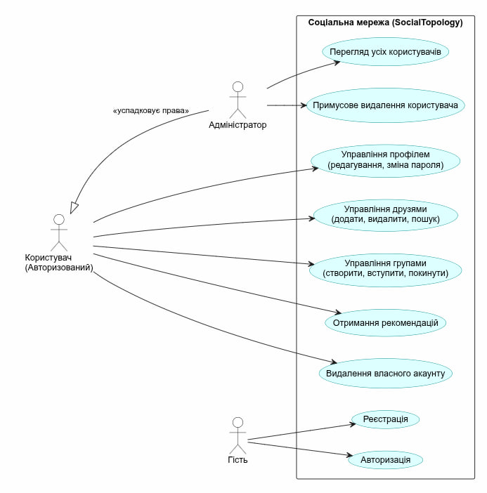

# SocialNetwork

Console social network simulator with graph-based user connections

## Project Overview

SocialNetwokr is an object-oriented application that models human social interactions using graph theory. It allows users to register, manage profiles, establish mutual friend connections, and join thematic groups. The project demonstrates core software engineering principles, including multi-layered architecture, data serialization, and secure password handling.

Built as a university course project, the codebase demonstrates layered OOP architecture, custom exception handling, and secure password storage.

## Use Case Diagram



The system has three actor types: **Guest** (can register and log in), **Authorized User** (full access to social features), and **Administrator** (inherits all user rights plus network management tools).

## Architecture

```
IDisplayable (interface)
    └── BaseEntity (abstract class)
            ├── User
            │     └── Admin          ← inherits all User behaviour + elevated privileges
            └── FriendGroup

UserProfile                          ← aggregated by User (composition)
SocialNetwork                        ← orchestrates all business logic
SecurityHelper                       ← static utility, SHA-256 hashing
NetworkException                     ← custom exception type
```

| Class              | Role                                                                    |
| ------------------ | ----------------------------------------------------------------------- |
| `IDisplayable`     | Contract: every entity exposes `GetInfo()`                              |
| `BaseEntity`       | Abstract base; holds `Guid Id` and implements `IDisplayable`            |
| `User`             | Core entity: login, hashed password, name, friends list, groups list    |
| `Admin`            | Extends `User`; unlocks force-delete and user listing                   |
| `UserProfile`      | Composition object: bio, registration date                              |
| `FriendGroup`      | Named community with a member list                                      |
| `SocialNetwork`    | Graph manager: registration, auth, friend/group operations, persistence |
| `SecurityHelper`   | Static utility: `HashPassword(string) → string` (SHA-256)               |
| `NetworkException` | Domain-level exception; caught and displayed in red by `Program.cs`     |

---

## Tech Stack

| Layer       | Technology                                                                              |
| ----------- | --------------------------------------------------------------------------------------- |
| Language    | C# 10                                                                                   |
| Runtime     | .NET 6.0                                                                                |
| Persistence | `System.Text.Json` with `ReferenceHandler.Preserve` (handles circular graph references) |
| Security    | `System.Security.Cryptography.SHA256`                                                   |
| IDE         | Visual Studio / Rider / VS Code                                                         |

---

## Features

- **User Authentication** — secure registration and login with SHA-256 password hashing
- **Profile Management** — edit display name and bio
- **Social Graph** — add or remove friends; view connections sorted by popularity
- **Smart Recommendations** — "People You May Know" based on mutual friend count (top 5)
- **Thematic Groups** — create, join, leave, and filter communities by member count
- **Data Persistence** — network state saves automatically to `data.json` on every change
- **Admin Panel** — view all users and force-delete accounts (login `admin` required)

---

## Getting Started

**Prerequisites:** [.NET 6.0 SDK](https://dotnet.microsoft.com/download/dotnet/6.0)

```bash
git clone https://github.com/<your-username>/SocialTopology.git
cd SocialTopology
dotnet run
```

`data.json` is created automatically on first launch. Delete it to reset all data. Add it to `.gitignore` to avoid committing user records.
